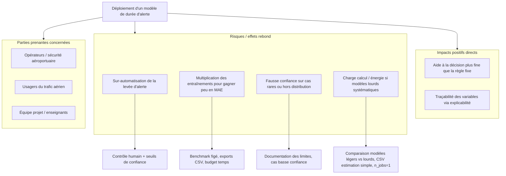

# Environnement et social - Data Battle IA PAU 2026

## 1) Objectif de cette note
Documenter les impacts environnementaux et sociaux du projet, et les actions concrètes mises en place pour améliorer le compromis performance / impact.

## 2) Mesure et estimation des impacts

### 2.1 Indicateurs déjà mesurés dans le code
- `compute_footprint_proxy.csv` : temps de calcul par modèle (proxy de consommation).
- `compute_footprint_estimate_simple.csv` : **ordre de grandeur** énergie (kWh) et **CO₂eq** (kg) à partir du temps mesuré et d’hypothèses documentées (sans CodeCarbon).
- `model_benchmark_report.csv` : performance + temps (permet de comparer efficacité vs coût de calcul).
- Exécution volontairement séquentielle (`n_jobs=1`) pour limiter les pics CPU/RAM.

### 2.2 Interprétation
- Les modèles les plus complexes (XGBoost/CatBoost/MLP) coûtent plus de temps de calcul.
- Les gains de performance doivent être mis en balance avec ce coût.
- Le choix final doit donc intégrer une logique de sobriété (pas seulement la meilleure MAE brute).

### 2.3 Quantification simple de l’énergie et du CO₂eq (sans outil externe)

Méthode **volontairement grossière** mais **explicite** : on ne mesure pas la puissance réelle du PC ; on combine le **temps CPU wall-clock** déjà enregistré par `modele.py` avec des **hypothèses** classiques en sobriété numérique.

**Formules**

- Énergie estimée : **E (kWh) ≈ P (kW) × t (h)** avec **P = puissance moyenne supposée** pour un portable sous charge (calcul sklearn / CV) et **t = durée du run** en heures.
- Équivalent carbone : **m (kg CO₂eq) ≈ E × i / 1000** avec **i = intensité carbone du mix électrique** en **g CO₂ par kWh** (valeur indicative pour la France).

**Hypothèses codées dans le projet** (modifiables dans `modele.py` si besoin) :

| Paramètre | Valeur retenue | Commentaire |
|-----------|----------------|-------------|
| Puissance moyenne supposée | **45 W** | Ordre de grandeur laptop sous charge ; poste fixe/workstation souvent plus. |
| Intensité carbone | **56 g CO₂ / kWh** | Ordre de grandeur **mix France** (chiffres publics évoluent ; non contractuel). |

À chaque fin de `modele.py`, le fichier **`compute_footprint_estimate_simple.csv`** est produit : détail **par modèle** + lignes **`_TOTAL_modeles_somme_temps`** et **`_TOTAL_temps_mur_run`** (temps total du script, plus conservateur pour le run entier).

**Exemple chiffré** (illustration, pas un résultat de votre machine) : si **t = 600 s** (10 min) et **P = 45 W** → **E ≈ 0,0075 kWh** → **m ≈ 0,00042 kg CO₂eq** avec **56 g/kWh**. Les **vrais chiffres** sont ceux du CSV après **votre** exécution.

**Limites** : pas de mesure matérielle ; GPU, veille, autres processus non isolés ; l’ordre de grandeur sert au **comparatif entre modèles** (temps) et à **documenter la démarche** pour le jury.

**Compléments optionnels**

- **Plateforme Gaia** (cours) : si l’école l’exige ou la propose, y reporter un run de référence.
- **CodeCarbon** : `pip install codecarbon` puis `python3 modele.py ... --codecarbon` pour une estimation basée sur des modèles de consommation plus fins (fichier `codecarbon_emissions_databattle.csv`, ignoré par git par défaut).

## 3) Cycle de vie (analyse qualitative)

### 3.1 Matériel et infrastructure
- Exécution locale (pas d'infra cloud lourde obligatoire).
- Réduction de l'empreinte réseau et de la dépendance à des services externes.

### 3.2 Logiciels et maintenance
- Stack Python standard (portable, maintenable, faible verrouillage techno).
- Scripts modulaires (`clustering.py`, `modele.py`, `probabilite_par_minute.py`).

### 3.3 Exploitation
- Possibilité d'exécuter uniquement les modèles nécessaires (évite des runs inutiles).
- Possibilité de désactiver des modèles lourds selon le contexte d'usage.

## 4) Effets rebond et risques indirects

- **Risque 1 : sur-automatisation** de la décision de levée d'alerte.
  - Mitigation : conserver un contrôle humain + seuils de confiance explicites.
- **Risque 2 : multiplication des runs** pour gagner marginalement en score.
  - Mitigation : protocole de benchmark stable et budget de calcul défini.
- **Risque 3 : faux sentiment de sécurité** sur cas rares.
  - Mitigation : suivi de métriques de sécurité dédiées (cas critiques proches aéroport).

### 4.1 Arbre de conséquences (impacts directs, indirects, mitigations)

Schéma synthétique demandé par la grille (effets rebond et parties prenantes). La même logique est détaillée en liste dans les points ci-dessus.

## 5) Actions déjà mises en place (green coding)

- Architecture modulaire et simple.
- Validation croisée robuste mais calibrée (3 plis).
- Tuning borné (espace et itérations limités selon modèle).
- Export de rapports pour éviter de relancer inutilement les expériences.
- Estimation **kWh / CO₂eq** automatique via `compute_footprint_estimate_simple.csv` ; **CodeCarbon** reste **optionnel** (`pip install codecarbon`, `--codecarbon`).

## 6) Compromis besoin métier / impact environnemental (alternatives)

| Levier | Alternative concrète dans le projet |
|--------|-------------------------------------|
| Modèle plus léger | Privilégier RF tuné ou baseline linéaire si MAE proche du meilleur ; désactiver XGBoost (`--xgboost off`) ou ne pas lancer CatBoost/MLP en production. |
| Réduction des usages | `--skip-clustering`, `--skip-analyse-aeroport`, `--skip-probabilites` ; tuning borné (`n_iter` limité) ; réutiliser les CSV benchmark sans relancer. |
| Limiter effets rebond | Seuils de probabilité documentés ; pas d’optimisation « en boucle » sur le jeu de validation ; garde-fous humains décrits en §4. |

## 7) Plan d'amélioration à court terme

1. **Consigner** après un run les lignes `_TOTAL_*` de `compute_footprint_estimate_simple.csv` dans le rapport jury ; compléter avec Gaia ou CodeCarbon si demandé.
2. Définir un budget calcul (temps max/run) et une règle de sélection explicite « MAE + coût calcul ».
3. Conserver une configuration "léger en production" (modèles rapides) et "complet en R&D".
4. Mettre en place un journal d'expériences pour éviter les exécutions redondantes.

## 8) Dimension sociale et parties prenantes

### 8.1 Parties prenantes
- Opérateurs aéroportuaires / décisionnaires sécurité.
- Étudiants et enseignants (transfert de compétences).
- Utilisateurs finaux impactés par les décisions d'alerte.

### 8.2 Apports
- Aide à la décision plus explicite et traçable.
- Meilleure compréhension des facteurs qui influencent les durées d'alerte.

### 8.3 Précautions
- Ne pas remplacer l'expertise métier : le modèle assiste, il ne décide pas seul.
- Documenter les limites et les cas où la confiance du modèle est faible.
